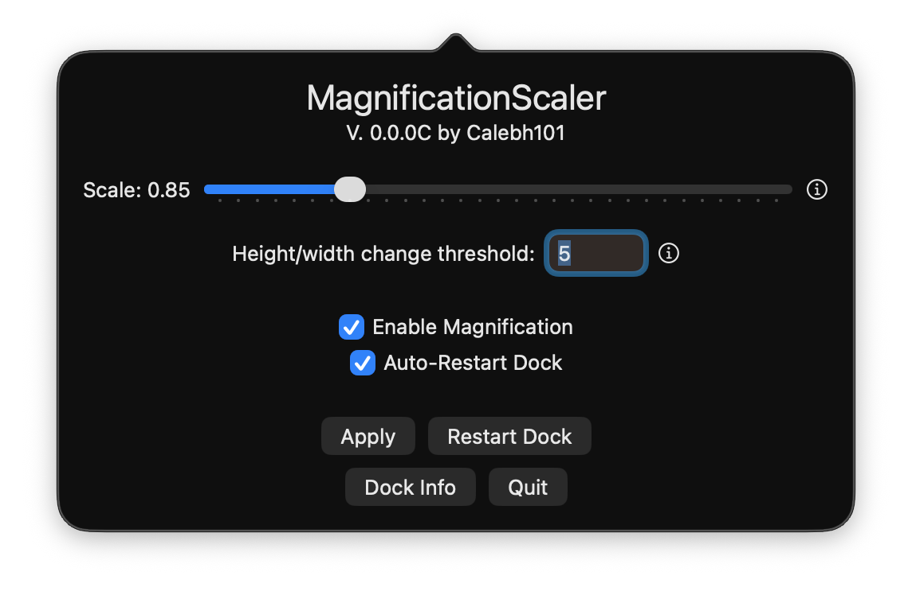

<h1 align="center">MagnificationScaler</h1>

A macOS app that makes the dock magnification scale with its size.

Has your dock ever automatically shrunk, but the magnification changed the same, giving it a weird feel? Well that's happened to me, so I made this!

## How it Works

This app monitors the dock's height (or width) and adjusts the magnification based on that. It writes to the dock's preferences (same as using the `defaults` command), then restarts the dock.

The caveat is that there is a small flicker when the dock restarts.

## Requirements

- macOS Big Sur and newer
- Accessibility permissions (Settings > Privacy & Security > Accessibility)
    - Needed to monitor the dock's size.

## Settings

- Scale: The scaling of the magnification compared to the dock's size. Use the Info button to learn more.
- Width/height change threshold: How much the width/height of the dock (based on location) needs to change before the dock is restarted. Only applicable if Auto-Restart Dock is on.
<!-- Dock location: The app needs to know this, so it knows whether to use the width or the height of the dock as its factor. Click the Info button to learn more.-->
- Enable Magnification: Whether to enable magnification. Turning this off doesn't disable the app's functionality; it just tells macOS to not use magnification. If you turn this off, you should also probably turn off Auto-Restart Dock.
- Auto-Restart Dock: To restart the dock automatically on size changes. If this is disabled, then it just skips restarting the dock, and you'll have to do this manually. The preferences will still be set.

## Buttons

- Apply: Apply the settings you set and restart the dock (if Auto-Restart Dock is enabled).
- Restart Dock: Same as running `killall dock`.
- Dock Info: View the current dock size and orientation in a popup.
- Quit: Quit MagnificationScaler.

## Video

This video shows how the app will automatically restart the dock. Notice the before and after of each restart.

## FAQ

  
Does the app monitor or listen?

  The app checks the dock size every **0.3** seconds. The dock doesn't allow streaming the dock size.

