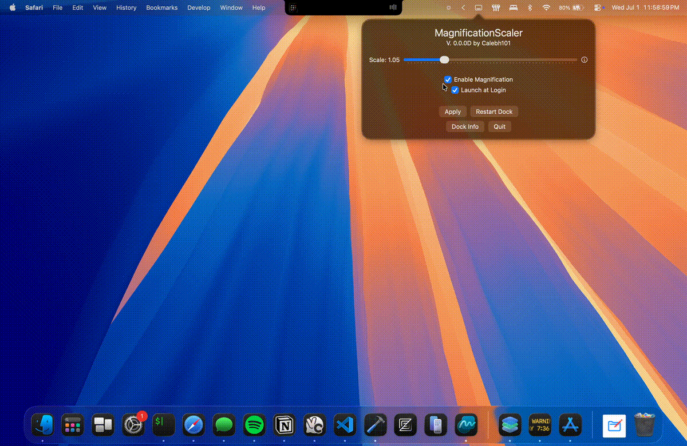

<h1 align="center">MagnificationScaler</h1>

A macOS app that makes the dock magnification scale with its size.

Has your dock ever automatically shrunk, but the magnification changed the same, giving it a weird feel? Well that's happened to me a few too many times, so I made this!

## How it Works

This app monitors the dock's height (or width) and adjusts the magnification based on that. It writes to the dock's preferences (same as using the `defaults` command) *and* uses AppleScript to send the settings right to the dock. This avoids having to restart the dock each time.

## Requirements

You'll be prompted about most of these.

- macOS Sonoma or newer
- Accessibility permissions (Settings > Privacy & Security > Accessibility)
    - Needed to monitor the dock's size.
- Automation (System Events) permissions (Settings > Privacy & Security > Automation)
    - This is to use AppleScript to update the magnification of the dock on the fly, instead of restarting it.

## Settings

- Scale: The scaling of the magnification compared to the dock's size. Use the Info button to learn more.
<!-- - Width/height change threshold: How much the width/height of the dock (based on location) needs to change before the dock is restarted. Only applicable if Auto-Restart Dock is on.
- Dock location: The app needs to know this, so it knows whether to use the width or the height of the dock as its factor. Click the Info button to learn more.-->
- Enable Magnification: Whether to enable magnification. Turning this off doesn't disable the app's functionality; it just tells macOS to not use magnification, which is a separate setting.
<!-- - Auto-Restart Dock: To restart the dock automatically on size changes. If this is disabled, then it just skips restarting the dock, and you'll have to do this manually. The preferences will still be set.-->
- Launch at Login: Start MagnificationScaler when you log in.

## Buttons

- Apply: Apply the settings you set instantly.
- Restart Dock: Same as running `killall dock`. (As of version 0.0.0D, this should be unnecessary.)
- Dock Info: View the current dock size and orientation in a popup.
- Quit: Quit MagnificationScaler.

## Video

This video shows how the app will automatically set magnification settings on the fly.

## FAQ

  
Does the app monitor or listen?

  The app checks the dock size every **0.3** seconds.

  
Does the dock have to restart?

  **No!** The dock doesn't have to restart, as of MagnificationScaler version 0.0.0D. The app now uses AppleScript to set the dock's magnification in real time.

